<!--
  This is the public front page of github.com/qbronco.

  It's written so it never needs a yearly update. Anything that changes
  (meeting dates, the room, officers, the sign-up form, this year's project)
  lives on qbronco.com, built from qbronco-website's src/data/ files, so this
  page links there instead of copying it. Repos to show off go in the org's
  pinned repositories, which GitHub lists right under this README.

  banner.svg is self-contained and animates once on load. See the comment at
  the top of that file before editing it.
-->

  

  <a href="https://qbronco.com"><b>qbronco.com</b></a>
  &nbsp;·&nbsp;
  <a href="https://qbronco.com/schedule">schedule</a>
  &nbsp;·&nbsp;
  <a href="https://qbronco.com/project">this&nbsp;year's&nbsp;project</a>
  &nbsp;·&nbsp;
  <a href="https://www.instagram.com/qbroncowmu/">instagram</a>
  &nbsp;·&nbsp;
  <a href="https://www.linkedin.com/company/qbronco">linkedin</a>
  &nbsp;·&nbsp;
  <a href="https://experiencewmu.wmich.edu/organization/qbroncos">experienceWMU</a>

### hey, we're the quantum broncos

**QBronco** is western michigan university's student quantum computing club. we learn it together from the ground up: qubits, superposition, and real Qiskit code on actual IBM machines. then we spend the year building something real with it.

you don't need to be a physics major, and you don't need to know any of this yet. that's what the meetings are for.

### come study with us

- **find the next meeting.** [qbronco.com/schedule](https://qbronco.com/schedule) always has it, or [put every meeting in your calendar](https://qbronco.com/schedule#calendar) and it stays up to date by itself.
- **tell us you're in.** the sign-up form is on [qbronco.com](https://qbronco.com). it takes a minute. you can also just show up.
- **follow along** on [instagram](https://www.instagram.com/qbroncowmu/) or [linkedin](https://www.linkedin.com/company/qbronco).

### on github

this is where the club's code lives. the pinned repos below are the best place to start. want to help? come to a lab night, or open an issue on any repo.
